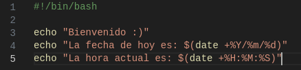

# **Actividad 3**

# Script

<p align="center">
  
</p>

#### Permisos de ejecución

<p align="center">
  
</p>

# Service


### Crear el service en la carpeta /etc/systemd/system

<p align="center">
  
</p>

<p align="center">
  
</p>

# Instalación y habilitación del servicio

### Ejecutar los siguientes comandos
```
# Recargar los servicios systemd
sudo systemctl daemon-reload

# Habilitar el servicio para que se inicie en el arranque
sudo systemctl enable Saludo.service

# Iniciar el servicio
sudo systemctl start Saludo.service

# Verificar el estado del servicio
sudo systemctl status Saludo.service

```

<p align="center">
  
</p>

### Comprobar el servicio

<p align="center">
  
</p>