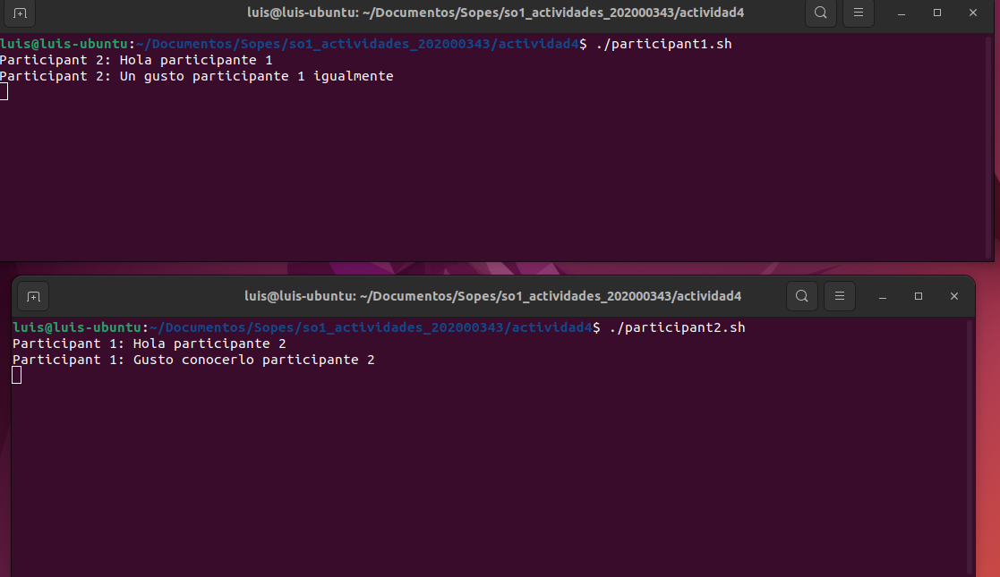

# Chat básico utilizando Named Pipes y bash
#### Luis Manuel Chay Marroquín // 202000343

Este es un chat básico para dos participantes implementado en Linux utilizando Named Pipes y bash.

## Funcionamiento

1. Ejecutar `mkfifo participant1_to_participant2` y `mkfifo participant2_to_participant1` para crear los Named Pipes.

```bash
mkfifo participant1_to_participant2
mkfifo participant2_to_participant1
```
2. Crear un script para cada participante con el siguiente contenido

-Primer participante

```bash
while true; do
    read message
    echo "Participant 1: $message" > participant1_to_participant2
done
```
-Segundo participante

```bash
while true; do
    read message
    echo "Participant 2: $message" > participant2_to_participant1
done
```


3. Guardar los scripts con los siguientes nombres `participant1.sh` y `participant2.sh` y hacerlos
ejecutables con los siguientes comandos `chmod +x participant1.sh` para el participante 1 y `chmod +x participant2.sh` para el participante 2.
3. Los participantes pueden enviar mensajes escribiéndolos y presionando Enter. Los mensajes se enviarán a través de los Named Pipes y se mostrarán en la pantalla del otro participante.



4. Para finalizar la conversación, ambos participantes pueden presionar `Ctrl + C` en sus terminales.